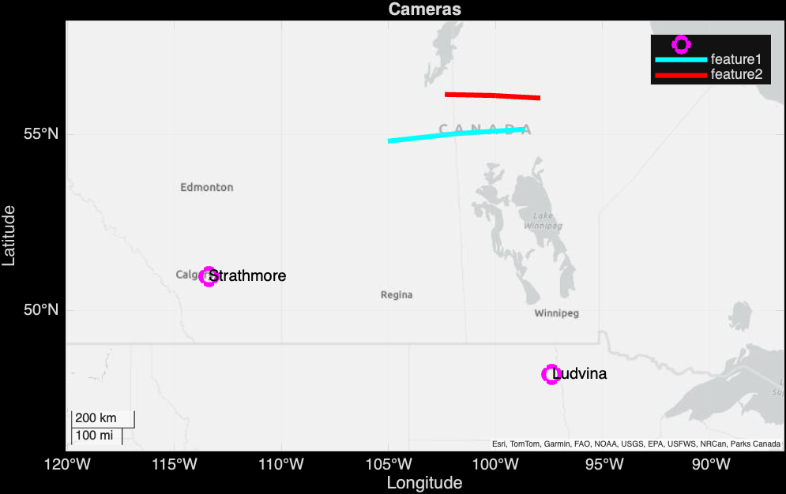

# steve-phantom
3D phantoms and mapping to get perspective on STEVE

Requires Matlab Mapping Toolbox

From Matlab type:

```matlab
steve_table
```

to generate a 3D map with phantom of STEVE morphology.

Hold the <kbd>Ctrl</kbd> key while click and drag with mouse to tilt 3D map.


